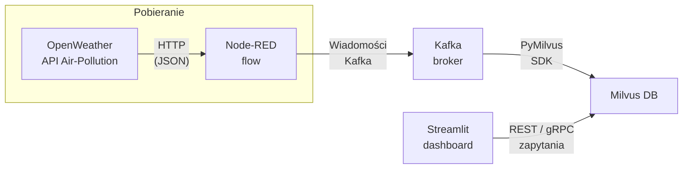

# 🌍  Pipeline IoT – Jakość powietrza

Kompletny przykład, który **pobiera w czasie rzeczywistym dane o zanieczyszczeniu powietrza** (OpenWeather), przesyła je przez Kafkę, zapisuje wektorowo w Milvusie i udostępnia wizualizację oraz wyszukiwanie podobieństw w apce Streamlit.

| Usługa       | Rola w systemie                                   | Port |
|--------------|---------------------------------------------------|------|
| **Node-RED** | Niskokodowy flow pobierający dane i publikujący do Kafki | `1880` |
| **Kafka**    | Broker komunikatów                                | `9092` / `2181` |
| **Milvus**   | Baza wektorowa (FAISS)                            | `19530` (gRPC) / `9091` (REST) |
| **Streamlit**| Dashboard i zapytania podobieństwa                | `8501` |

---

## ⚡️ Architektura




## 📥 1. Klonowanie repozytorium

```bash
git clone https://github.com/bartoszgalaszewski/iot_project.git
cd iot_project
```

---

## 🛠️ 2. Wymagania

* Zainstalowany Docker (>= 20.10) i Docker Compose
* Dostęp do internetu (OpenWeather API)

---

## 🚀 3. Szybki start

1. **Usuń stare dane** (jeśli istnieją):

   ```bash
   docker compose down -v
   ```


````
2. **Uruchom wszystkie serwisy**:
   ```bash
docker compose up --build -d
````

> Serwisy to:
>
> * Zookeeper, Kafka
> * Node-RED (port 1880)
> * Consumer Python (wektoryzacja, Milvus)
> * Milvus (etcd, minio, standalone)
> * Streamlit Dashboard (port 8501)

---

## ✅ 4. Weryfikacja stanu kontenerów

```bash
docker compose ps
```

Powinieneś zobaczyć wszystkie usługi w statusie `Up`.

---

## 🔗 5. Sprawdzenie sieci Node-RED → Kafka

```bash
docker compose exec --user root node-red sh -c "apk update && apk add --no-cache netcat-openbsd && nc -vz kafka 9092"
```

Oczekiwany wynik:

```
Connection to kafka 9092 port [tcp/*] succeeded!
```

---

## 📝 6. Test publikacji w Node-RED

1. Otwórz w przeglądarce [http://localhost:1880](http://localhost:1880).
2. Wgraj lub potwierdź, że Twój flow pobiera dane z OpenWeather i publikuje do tematu `air_quality`.
3. Dodaj węzeł **Inject** z prostym JSON-em testowym:

   ```json
   {"device":"nr-test","pm25":1.2,"pm10":2.3,"co2":350,"temperature":21,"humidity":45}
   ```
4. Połącz **Inject** z węzłem publikującym i **Debug**.
5. Kliknij **Deploy**, a następnie **Inject** i sprawdź brak błędów w panelu Debug.

---

## 🛎️ 7. Test konsumenta i CLI Kafka

1. Wyślij wiadomość przez CLI:

   ```bash
   ```

echo '{"device":"cli-test","pm25":9.9,"pm10":4.4,"co2":420,"temperature":19,"humidity":60}'&#x20;
\| docker compose exec -T kafka kafka-console-producer.sh&#x20;
\--bootstrap-server kafka:9092 --topic air\_quality

````
2. Odbierz wiadomości:
   ```bash
   docker compose exec kafka kafka-console-consumer.sh \
     --bootstrap-server kafka:9092 --topic air_quality --from-beginning --timeout-ms 5000
````

3. Upewnij się, że widzisz dane `nr-test` i `cli-test`.

---

## 💾 8. Weryfikacja zapisu w Milvus

```bash
docker compose logs -f consumer
```

W logach powinny pojawić się wpisy typu:

```
[+] Inserted vector for <device> @ <timestamp>; Milvus IDs: [...]
```

---

## 📊 9. Sprawdzenie dashboardu Streamlit

Otwórz [http://localhost:8501](http://localhost:8501) i zweryfikuj:

* Wyświetlanie najnowszych danych
* Funkcję wyszukiwania podobnych warunków

---

## 📂 10. Podsumowanie struktury katalogów

```
iot_project/
├─ consumer/      # Skrypt consumer.py + requirements.txt
├─ dashboard/     # Aplikacja Streamlit + requirements.txt
├─ node-red/      # settings.js i przykładowy flow.json
├─ docker-compose.yml
└─ README.md      # Ten plik
```

---

### 🔧 Uwagi końcowe

* Flows Node-RED przechowywane są w wolumenie `node_red_data`.
* Jeśli zmieniasz JSON lub format wektorów, zaktualizuj `consumer.py`.
* Milvus może wymagać zwiększenia zasobów RAM.
* W razie problemów sieciowych sprawdź sekcję `networks` w `docker-compose.yml`.

---
